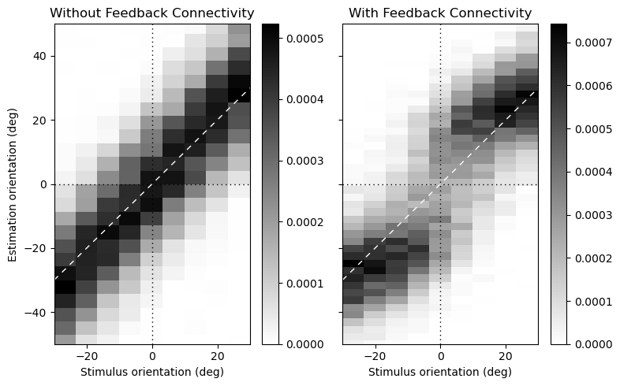

# A recurrent network model of self-induced biases in working memory


### Disclaimer

This code has been develped in a [separate directory](https://github.com/CSNLstudy/det_rnn) by a project group at [Cognitive and Systems Neuroscience Lab(CSNL)](https://www.snu-csnl.com/), [Seoul National University](https://en.snu.ac.kr/). It was originally based on the public code provided by [`Masse *et al.*, 2019, Nature Neuroscience`](https://github.com/nmasse/Short-term-plasticity-RNN). 

### How to run



You can train the 20 networks and visualize as the above figure with the following code. Networks jointly perform decision-making (DM) and estimation (EM) tasks. The resulting data files will be saved in `save/data_*_*`.

```
python main.py
```

Codes were tested under `Tensorflow 2.4.1`, `Python 3.8`, MacOS 11.4.


### Source structure 
Basic structure of the code has been set as follows.

```
base/ 
	_stimulus.py
	_parameters.py
	functions.py

train/
	trainer.py
	hyper.py
	model.py

analysis/
	inspect_behav.py
```

### Contributors

(Alphabetic order of surnames) 
[Hyunwoo Gu](https://github.com/hyunwoogu/)(SNU), [Heeseung Lee](https://github.com/Heeseung-Lee)(SNU), [Hyang-Jung Lee](https://github.com/hyangjung-lee)(SNU), [Jaeseob Lim](https://github.com/jaeseob)(SNU), [Jun Hwan (Joshua) Ryu](https://github.com/joshryu0425)(Stanford)
